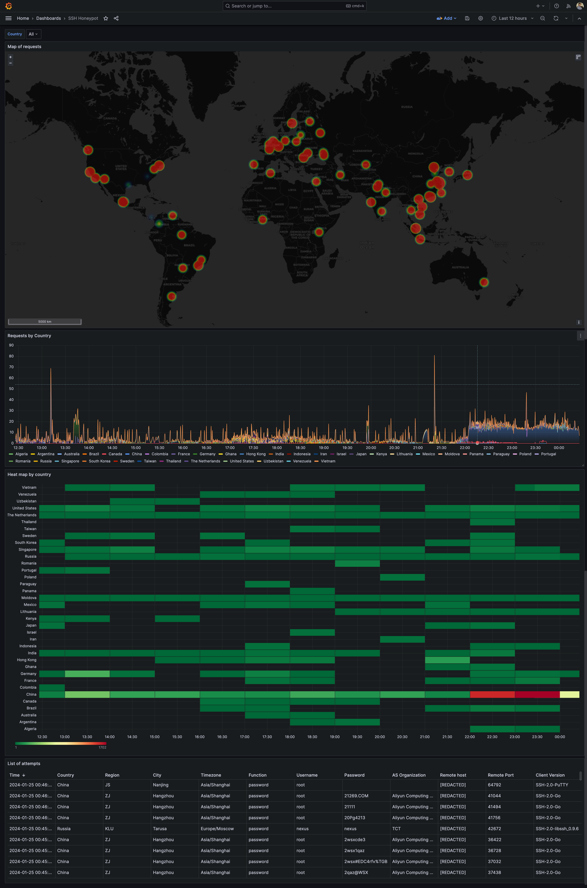

# SSH-Honeypot

Simple SSH Honeypot server the enrich the information of the attacker and store it on InfluxDB, relying on Otel for logging and instrumentation


## Grafana dashboard
- [Download Grafana dashboard](assets/ssh-honeypot-grafana-dashboard.json)




## Useful commands

### Run full stack
```sh
docker-compose up -d jaeger influxdb
docker-compose up --build ssh-honeypot
```

### Deleting points
```sh
docker run -it --rm influxdb influx delete --org-id $INFLUXDB_ORG --bucket $INFLUXDB_BUCKET --host $INFLUXDB_URL --token $INFLUXDB_TOKEN --start '2009-01-02T23:00:00Z' --stop '2029-01-02T23:00:00Z' --predicate 'ip="::1"'
```
